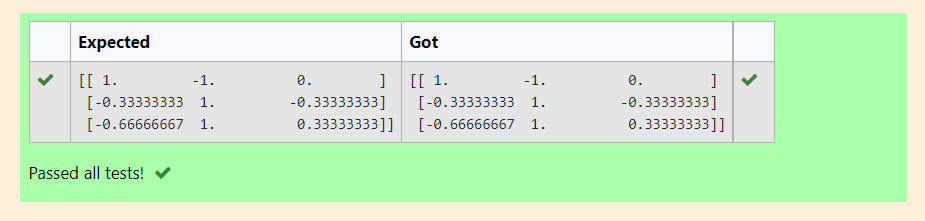

# INVERSE-OF-A-MATRIX

## Aim:
To write a python program to find the inverse of a matrix.

## Equipment’s required:
1. 	Hardware – PCs
2. 	Anaconda – Python 3.7 Installation / Moodle-Code Runner

## Algorithm:
### Step1 :
Import the numpy module to use the built-in functions for calculation.

### Step 2:
Prepare the list from matrix and assign in np.array().

### Step 3: 
Using the np.linalg.inv(), we can find the solutions.

### Step 4:
End the Program. 

## Program:
```
#Program to find the inverse of a matrix.
#Developed by:Rithiga sri.B
#RegisterNumber:21500732

import numpy as np
A=np.array([[2,1,1],[1,1,1],[1,-1,2]])
value=np.linalg.inv(A)
print(value)
```


## Output:


## Result:
Thus the inverse of given matrix is successfully solved using python program.

